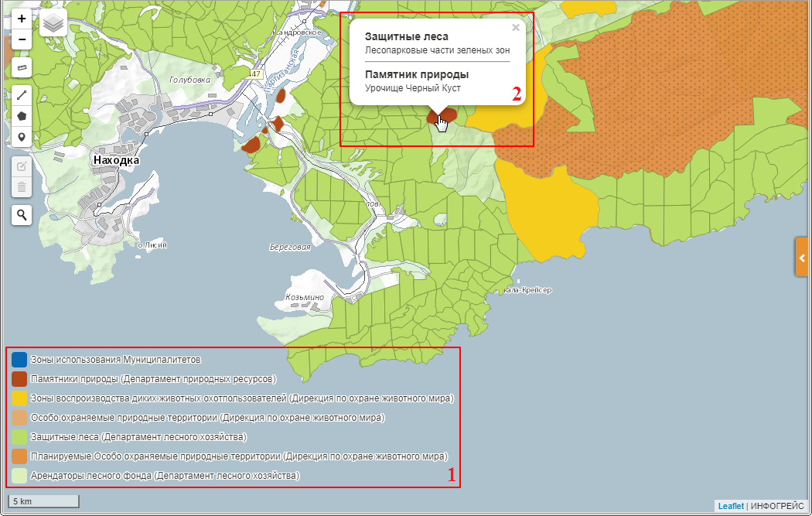
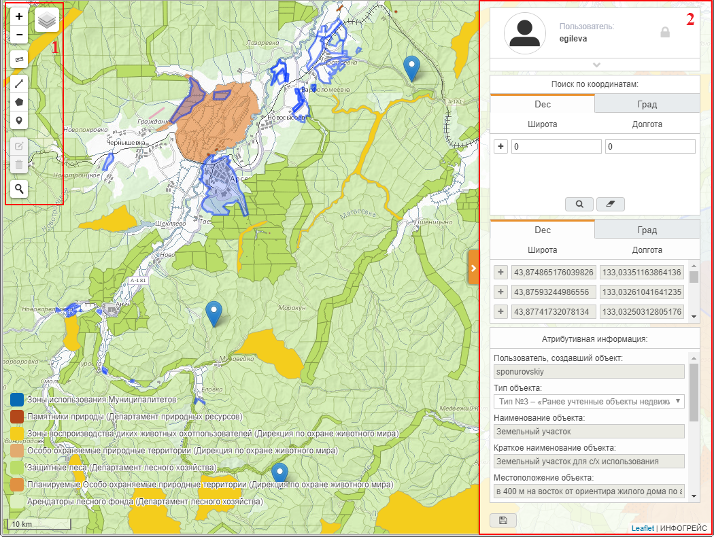
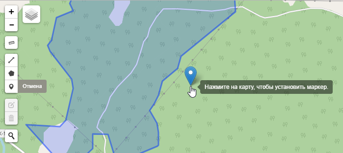
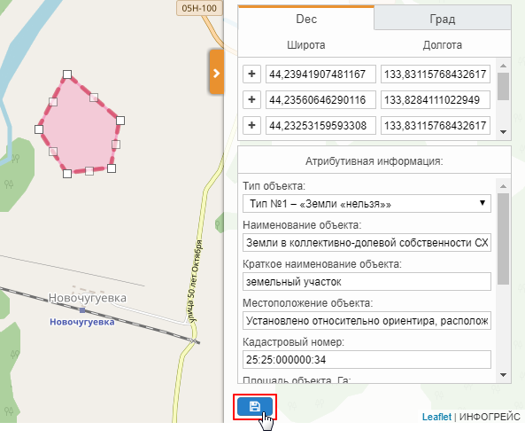
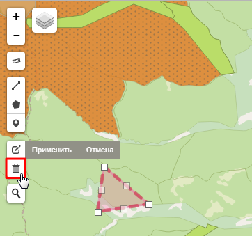

Назначение системы
==================

Система сбора данных о земельных участках (далее – *система*) разработана компанией «Инфогрейс» и предназначена для учета земель, которые не подлежат передаче гражданам РФ в рамках программы «Дальневосточный гектар».

С помощью системы операторы сохраняют геокоординаты и атрибутивную информацию о следующих категориях земель: действующие и планируемые
особо охраняемые природные территории, зоны защитных лесов, земли арендаторов лесного фонда, зоны использования муниципалитетов и т.д.
Геоинформация и атрибутивная информация об учтенных участках автоматически передается из системы сбора данных о земельных участках в
систему государственной регистрации, кадастра и картографии.

Вход в систему
==============

Для работы с системой сбора данных о земельных участках необходимо подключение к сети Интернет. Работа осуществляется в окне
программы-браузера.

Чтобы выполнить вход в систему, в адресной строке браузера укажите адрес системы, предоставленный системным администратором и нажмите на клавишу **Enter** на клавиатуре. На странице авторизации пользователя (рис. 1) введите **Логин** и **Пароль**, предоставленные системным администратором, и нажмите на кнопку **Войти в систему**.

           Рисунок 1 – Окно авторизации

Откроется главное окно системы (рис. 2).

Интерфейс
=========

Главное окно системы представлено на рисунке 2.

В основной рабочей области окна расположена карта особо охраняемых природных территорий России. ООПТ, в зависимости от их назначения,
отмечены на карте различными цветами. Расшифровка цветового обозначения представлена на легендах в левом нижнем углу карты (рис. 2, цифра 1). Описание ООПТ отображается при нажатии на требуемую территорию левой клавишей мыши (рис. 2, цифра 2).

           Рисунок 2 – Главное окно системы

Изменение масштаба карты выполняется стандартными способами, которые используются при работе с географическими информационными системами. Например:

-  Прокруткой колесика мыши: прокручивание от себя увеличивает масштаб, на себя – уменьшает.
-  С помощью кнопок увеличения и уменьшения масштаба, которые расположены на панели инструментов (см. рисунок 3, цифра 1).

Текущий масштаб карты отображается в левом нижнем углу.

Для перемещения по карте можно использовать клавиши клавиатуры, на которых изображены стрелки, указывающие вверх, вниз, влево и вправо. Кроме того, перемещаться по карте можно, удерживая левую клавишу мыши.

Для работы с картой предназначены следующие элементы управления (рис. 3):

1. Панель инструментов.
2. Панель данных – разворачивается при нажатии на кнопку, представленную на рисунке 2 под цифрой 3.

           Рисунок 3 – Элементы управления

С помощью кнопок, расположенных на панели инструментов, можно выполнить следующие действия:

|image1| – Выбрать геоподоснову – картографическую поверхность, которая служит фоном для основного слоя карты.

|image2| – Увеличить или |image3| – уменьшить масштаб карты.

|image4| – Измерить расстояние от одной до другой точки на карте линейкой.

|image5| – Нарисовать линию (см. раздел `Создание участка путем отрисовывания на карте`_).

|image6| – Нарисовать полигон (см. раздел `Создание участка путем отрисовывания на карте`_).

|image7| – Нарисовать маркер (см. раздел `Создание участка путем отрисовывания на карте`_).

|image8| – Редактировать участок (см. раздел `Редактирование участка`_).

|image9| – Удалить участок (см. раздел `Удаление участка`_).

|image10| – Найти рабочую область по названию населенного пункта (см. раздел `Поиск по названию населенного пункта`_).

На панели данных расположены следующие блоки информации (рис. 4):

1. Область данных пользователей, авторизованных в системе. В данной области отображаются:

   -  имя учетной записи текущего пользователя;
   -  кнопка |image11| для выхода из системы (см. раздел `Выход из системы`_);
   -  кнопка |image12|, при нажатии на которую разворачивается список всех пользователей, авторизованных в системе в настоящий момент.

2. Область, которая предназначена для поиска рабочей области по геокоординатам (см. раздел `Поиск по географическим координатам`_).
3. Область, которая предназначена для просмотра, создания и редактирования геокоординат участка (см. разделы `Просмотр участка`_, `Создание участка путем ввода координат`_ и `Редактирование участка`_).
4. Область, которая предназначена для просмотра и ввода атрибутивной информации об участке (см. раздел `Просмотр участка`_, `Ввод атрибутивной информации`_ и `Редактирование участка`_).
5. Кнопка сохранения данных об участке (см. раздел `Сохранение участка`_).

           Рисунок 4 – Панель данных

Порядок действий
================

Основной сценарий работы оператора включает следующие действия:

1. Поиск рабочей области на карте (см. раздел `Поиск рабочей области`_).
2. Создание участка путем нанесения на карту точки/линии/полигона (см. раздел `Создание участка путем отрисовывания на карте`_) или путем указания геокоординат участка (см. раздел `Создание участка путем ввода координат`_).
3. Описание участка (см. раздел `Ввод атрибутивной информации`_).
4. Сохранение атрибутивной и геоинформации об участке и передача данных в систему государственной регистрации, кадастра и картографии (см. раздел `Сохранение участка`_).

В рамках выполнения основного сценария операторы также могут при необходимости выполнять следующие действия:

1. Просмотр собственных участков и участков, нанесенных на карту другими операторами (см. раздел `Просмотр участка`_).
2. Редактирование собственных участков (см. раздел `Редактирование участка`_).
3. Удаление собственных участков (см. раздел `Удаление участка`_).

Работа с системой
=================

Поиск рабочей области
---------------------

Поиск по названию населенного пункта
^^^^^^^^^^^^^^^^^^^^^^^^^^^^^^^^^^^^

Чтобы выполнить поиск рабочей области по названию населенного пункта, на панели инструментов нажмите на кнопку |image10|. В строке поиска введите полное наименование населенного пункта (рис. 5) и нажмите на клавишу **Enter** на клавиатуре.

           Рисунок 5 – Строка поиска

Откроется выпадающий список (рис. 6), в котором будут перечислены все населенные пункты, удовлетворяющие условиям поиска. Выберите требуемый населенный пункт из выпадающего списка щелчком левой клавиши мыши.

           Рисунок 6 – Результаты поиска

Фокус на карте автоматически переместится в место расположения указанного населенного пункта (рис. 7).

           Рисунок 7 – Фокус установлен на требуемом объекте

Поиск по географическим координатам
^^^^^^^^^^^^^^^^^^^^^^^^^^^^^^^^^^^

Поиск рабочей области на карте можно выполнить по географическим координатам. Для поиска можно указать:

- Одну пару координат – в данном случае в требуемом месте карты будет установлена точка.
- Две и более пары координат – при вводе двух пар координат в требуемом месте карты будет нарисована линия, при вводе более двух пар координат в требуемом месте карты будет нарисован полигон.

Чтобы указать на карте координаты для поиска точки, на панели данных, в области **Поиск по координатам** (рис. 8) выберите требуемый
формат ввода:

- **Dec** – в градусах в виде десятичной дроби (разделитель – запятая). Данный формат выбран по умолчанию.
- **Град** – в градусах, минутах и секундах.

Переключение между форматами осуществляется с помощью вкладок **Dec** и **Град**.

В выбранной вкладке, в полях **Широта** и **Долгота** введите пару координат точки, которую необходимо найти на карте.

Чтобы выполнить поиск, нажмите на кнопку |image13|. Точка с указанными координатами будет отмечена на карте с помощью маркера.

           Рисунок 8 – Поиск точки

Чтобы указать на карте координаты для поиска линии/полигона, укажите первую пару координат так, как это описано выше. Затем добавьте поля для ввода второй пары координат одним из следующих способов:

- Нажмите левой клавишей мыши на кнопку |image14|, которая расположена слева от первой пары координат.
- Нажмите правой клавишей мыши на кнопку |image14|, которая расположена слева от первой пары координат, и выполните команду контекстного меню **Добавить** (рис. 9).

           Рисунок 9 – Добавление полей для ввода координаты

Введите в добавленную пару полей координаты второй точки фигуры. При необходимости аналогичным образом добавьте и заполните поля для других точек требуемой фигуры.

Координаты указанных точек фигуры можно редактировать. Между точками фигуры можно добавлять промежуточные точки.

Чтобы выполнить поиск фигуры, нажмите на кнопку |image13|. Фигура с указанными координатами отобразится на карте (рис. 10).

           Рисунок 10 – Поиск полигона

При необходимости на карте можно выделить какую-либо одну точку фигуры. Для этого нажмите правой клавишей мыши на кнопку |image14|, расположенную слева от пары координат требуемой точки, и выполните команду контекстного меню **Посмотреть на карте** (рис. 11).

.. figure:: _static/poisk_7.png
           :scale: 100 %
           :align: center 

           Рисунок 11 – Контекстное меню

Над требуемой точкой отобразится всплывающее окно с ее географическими координатами (рис. 12).

           Рисунок 12 – Просмотр точки фигуры

Если требуется удалить какую-либо пару координат, указанную для поиска, выполните команду контекстного меню **Удалить** (рис. 13). Если требуется удалить все указанные координаты, нажмите на кнопку |image15|.

           Рисунок 13 – Удаление координат

Работа с участками
------------------

На карте отображаются участки, которые были нанесены всеми операторами за все время работы с системой. Участки обозначены следующими цветами:

- **Розовый** – в данный цвет окрашиваются участки, добавленные на карту оператором, который в данный момент авторизован в системе (собственные участки). При работе с такими участками оператору доступны следующие операции: просмотр геокоординат и атрибутивной информации об участке, редактирование участка, удаление участка.
- **Синий** – в данный цвет окрашиваются участки, добавленные на карту другими операторами. При работе с такими участками текущему оператору доступна только операция просмотра геокоординат и атрибутивной информации об участке.

Просмотр участка
^^^^^^^^^^^^^^^^

Чтобы просмотреть информацию о каком-либо участке, обозначенном на карте, щелкните по нему левой клавишей мыши и во всплывающем сообщении нажмите на кнопку **Просмотреть** |image16| (рис. 14).

           Рисунок 14 – Кнопка **Просмотреть**

На панели данных отобразятся:

1. Область, которая содержит геокоординаты участка (рис. 15, цифра 1). Если участок представляет собой линию или полигон, то при необходимости можно выделить на карте какую-либо одну точку, которую содержит данная фигура. Для этого нажмите правой клавишей мыши на кнопку |image14|, расположенную слева от пары координат требуемой точки фигуры, и выполните команду контекстного меню **Посмотреть на карте**.
2. Область с атрибутивной информацией об участке (рис. 15, цифра 2). В режиме просмотра в данной области содержится набор полей, который отображается в режиме создания участка (см. раздел `Ввод атрибутивной информации`_), а также дополнительное поле **Пользователь, создавший объект**.

В режиме просмотра поля с геокоординатами и атрибутивной информацией заблокированы независимо от того, каким оператором был создан данный участок. Если требуется изменить геокоординаты или атрибутивную информацию о собственном участке, перейдите в режим его редактирования (см. раздел `Редактирование участка`_).

           Рисунок 15 – Просмотр геокоординат и атрибутивной информации

Создание участка
^^^^^^^^^^^^^^^^

Участок может быть представлен на карте в виде точки, линии или полигона (рис. 16).

Участок можно нарисовать на карте с помощью курсора мыши или создать путем ввода координат на панели данных. Эти способы создания участков при необходимости можно сочетать друг с другом.

           Рисунок 16 – Фигуры участков

Создание участка путем отрисовывания на карте
"""""""""""""""""""""""""""""""""""""""""""""

Участок любой формы можно нарисовать на карте с помощью курсора мыши. При этом на панели данных, в области геокоординат автоматически рассчитываются координаты точки/крайних точек фигуры участка.

Чтобы нарисовать на карте участок в виде точки, нажмите на панели инструментов на кнопку |image7| (рис. 17). Над курсором мыши отобразится маркер. Щелчком левой клавиши мыши установите данный маркер в том месте карты, в котором должен располагаться участок.

.. figure:: _static/sozdanie_2.png
           :scale: 100 %
           :align: center

           Рисунок 17 – Создание участка в виде точки

На карте отобразится маркер (окрашен в синий цвет) и эскиз маркера (окрашен в красный цвет и обведен пунктирной линией).

           Рисунок 18 – Маркер установлен

Если требуется редактировать расположение маркера, перенесите его эскиз в требуемое место карты (рис. 19).

После этого на панели данных укажите атрибутивную информацию об участке так, как это описано в разделе `Ввод атрибутивной информации`_, и сохраните участок так, как это описано в разделе `Сохранение участка`_.

Положение маркера сохранится в соответствии с положением эскиза.

           Рисунок 19 – Перемещение эскиза маркера

Чтобы нарисовать на карте участок в виде линии, на панели инструментов нажмите на кнопку |image5| (рис. 20).

Щелкните курсором мыши по тому месту карты, в котором должна располагаться первая точка участка. Затем переместите курсор мыши в то
место карты, в котором должна располагаться вторая точка участка. Между данными точками отобразится пунктирная линия, а над курсором мыши отобразится расстояние (в км) между этими точками. Если данные верны, установите вторую точку участка щелчком мыши.

При необходимости вторую точку линии можно удалить. Для этого следует нажать на кнопку **Удалить последнюю точку**, которая отображается справа от кнопки |image5|. После этого
вторую точку линии следует установить повторно.

           Рисунок 20 – Создание участка в виде линии

Чтобы закончить рисование линии, повторно нажмите на вторую точку линии или нажмите на кнопку **Конец** (рис. 21).

           Рисунок 21 – Завершение создания линии

На карте отобразится линия (окрашена в розовый цвет) и эскиз линии (обозначен красным пунктиром поверх линии).

           Рисунок 22 – Линия и эскиз линии

Если требуется редактировать расположение какой-либо точки линии, перетащите мышью эскиз данной точки в требуемое место карты (рис. 23).

После этого на панели данных укажите атрибутивную информацию об участке так, как это описано в разделе `Ввод атрибутивной информации`_, и сохраните участок так, как это описано в разделе `Сохранение участка`_.

Положение линии сохранится в соответствии с положением эскиза.

           Рисунок 23 – Редактирование линии

Чтобы нарисовать на карте участок в виде полигона, на панели инструментов нажмите на кнопку |image6| и щелчками мыши по карте обозначьте крайние точки участка (рис. 24).

При необходимости последнюю установленную точку полигона можно удалить. Для этого следует нажать на кнопку **Удалить последнюю точку**, которая отображается справа от кнопки |image6|.

Чтобы закончить рисование полигона, нажмите повторно на его первую точку или на кнопку **Конец**, которая отображается справа от кнопки |image6|.

           Рисунок 24 – Создание участка в виде полигона

На карте отобразится полигон (окрашен в розовый цвет) и эскиз полигона (обозначен красным пунктиром поверх контура полигона).

На панели данных, в области **Атрибутивная информация**, в поле **Площадь объекта, Га** автоматически рассчитается площадь созданного полигона (см. раздел `Ввод атрибутивной информации`_). Если это необходимо, то площадь, рассчитанную автоматически, можно отредактировать вручную. Контуры полигона, обозначенного на карте, при этом не изменятся.

           Рисунок 25 – Полигон и эскиз полигона

Расположение какой-либо точки полигона можно редактировать. Для этого следует перетащить мышью эскиз данной точки в требуемое место (рис. 26). При этом следует помнить, что если на карте редактируется контур полигона, то на панели данных происходит автоматический пересчет площади этого полигона. Если площадь полигона до этого была отредактирована вручную, то ее следует отредактировать повторно.

           Рисунок 26 – Редактирование фигуры полигона

После того как отрисовывание контура полигона будет завершено, на панели данных укажите атрибутивную информацию об участке так, как это описано в разделе `Ввод атрибутивной информации`_, и сохраните участок так, как это описано в разделе `Сохранение участка`_.

Контур полигона сохранится в соответствии с контуром эскиза.

Создание участка путем ввода координат
""""""""""""""""""""""""""""""""""""""

Создание участка, имеющего форму линии/полигона, можно выполнить путем поочередного ввода координат, из которых он состоит. Ввод координат участка осуществляется на панели данных.

Чтобы обозначить на карте первую точку участка, в визуальном редакторе нажмите на кнопку |image7| (рис. 27). Над курсором мыши отобразится маркер.

           Рисунок 27 – Установка маркера

Щелчком левой клавиши мыши установите данный маркер в том месте карты, в котором должна располагаться первая точка участка.

На панели данных отобразятся координаты указанной точки (рис. 28). При необходимости эти координаты можно редактировать. Редактирование и ввод координат можно выполнять в одном из следующих форматов:

- **Dec** – в градусах в виде десятичной дроби (разделитель – запятая). Данный формат выбран по умолчанию.
- **Град** – в градусах, минутах и секундах.

Переключение между форматами осуществляется с омощью вкладок **Dec** и **Град**.

           Рисунок 28 – Маркер установлен

Чтобы добавить поля для ввода второй пары координат участка, выполните одно из следующих действий:

- Нажмите левой клавишей мыши на кнопку |image14|, которая расположена слева от первой пары координат.
- Нажмите правой клавишей мыши на кнопку |image14|, которая расположена слева от первой пары координат, и выполните команду контекстного меню **Добавить** (рис. 29).

           Рисунок 29 – Добавление полей для ввода второй координаты

Введите в добавленную пару полей координаты второй точки участка.

Если участок представляет собой полигон, аналогичным образом добавьте и заполните поля для других точек участка. Точки полигона можно указывать как в порядке их следования, так и в произвольном порядке. Например, чтобы добавить промежуточную точку между второй и третьей парой координат, следует выполнить одно из следующих действий:

- Нажать левой клавишей мыши на кнопку |image14|, которая расположена слева от второй пары координат.
- Нажать правой клавишей мыши на кнопку |image14|, которая расположена слева от второй пары координат, и выполните команду контекстного меню **Добавить** (рис. 30).

           Рисунок 30 – Добавление промежуточной точки

Если какую-либо из указанных пар координат фигуры следует выделить на карте, выполните для нее команду контекстного меню **Просмотреть на карте** (рис. 30).

Если какую-либо из указанных пар координат следует удалить из состава фигуры, выполните для этой пары координат команду контекстного меню **Удалить**.

В процессе ввода данных на карте в реальном режиме времени отрисовывается геометрическая фигура, соответствующая указанным координатам. При редактировании координат фигура видоизменяется и/или перемещается.

Следует помнить, что для участка, имеющего форму полигона, первая и последняя пара координат должна быть идентичной, чтобы фигура получилась замкнутой. Когда точки полигона соединяются, на панели данных, в области **Атрибутивная информация**, в поле **Площадь объекта, Га** автоматически рассчитывается площадь созданной фигуры (см. раздел `Ввод атрибутивной информации`_).

Прочие поля с атрибутивной информацией следует заполнить вручную. Описание полей представлено в разделе ниже.

Ввод атрибутивной информации
""""""""""""""""""""""""""""

Для ввода атрибутивной информации об участке предназначена область, представленная на рисунке 31.

Данная область содержит следующие поля:

- **Тип объекта** – выбирается из фиксированного выпадающего списка.
- **Наименование объекта** – полное наименование объекта. Например, «Земельный участок оросительной системы “Березовская”».
- **Краткое наименование объекта** – например, «РОС “Березовская”».
- **Местоположение объекта** – текстовое описание местоположения объекта. Например: «примерно в 1315 м на север от здания конторы, по адресу: с. Гражданка, ул. Центральная, 1а».
- **Кадастровый номер** – кадастровый номер участка.
- **Площадь объекта, Га** – в данном поле автоматически рассчитывается площадь участков, имеющих форму полигона. При создании полигона поле остается пустым, пока точки фигуры не замкнутся. При редактировании точек полигона его площадь автоматически пересчитывается.
- **Наименование вида документа** – наименование, номер и дата выдачи документа, в котором содержится информация о владельце и назначении участка. Например, «Постановление администрации Анучинского района №230 от 28.05.1993 г.».
- **Наименование федерального органа** – федеральный орган, к которому относится структурное подразделение (см. ниже), выдавшее документ. Например, «Администрация Анучинского муниципального района».
- **Наименование структурного подразделения** – наименование структурного подразделения, выдавшего документ. Например, «Отдел по имущественным отношениям».
- **Дата актуализации** – дата ввода атрибутивной информации. Указывается вручную.

.. figure:: _static/vvod_atrib_inf_1.png
           :scale: 100 %
           :align: center

           Рисунок 31 – Область **Атрибутивная информация**

Сохранение участка
""""""""""""""""""

Чтобы сохранить геокоординаты и атрибутивную информацию об участке, в нижней части панели данных нажмите на кнопку **Сохранить** |image17| (рис. 32).

           Рисунок 32 – Кнопка **Сохранить**

Во всплывающих сообщениях, представленных на рисунках 33 и 34, поочередно нажмите на кнопку **ОК**.

           Рисунок 33 – Сохранение изменений в БД
		   

           Рисунок 34 – Изменения сохранены в БД

Данные об участке будут автоматически экспортированы в файлы mid/mif и переданы в систему государственной регистрации, кадастра и картографии.

Редактирование участка
^^^^^^^^^^^^^^^^^^^^^^

Чтобы редактировать геокоординаты или атрибутивную информацию о каком-либо участке, обозначенном на карте, щелкните по нему левой клавишей мыши и во всплывающем сообщении нажмите на кнопку **Редактировать** |image18| (рис. 35).

           Рисунок 35 – Кнопка **Редактировать**

Редактирование местоположения участка/крайних точек участка осуществляется аналогично их редактированию при создании участка:

- Путем перемещения точек эскиза участка с помощью курсора мыши (рис. 36, цифра 1) (подробно см. в разделе `Создание участка путем отрисовывания на карте`_).
- Путем редактирования геокоординат участка на панели данных (рис. 36, цифра 2) (подробно см. в раздел `Создание участка путем ввода координат`_).

Редактирование атрибутивной информации осуществляется непосредственно в блоке полей **Атрибутивная информация** на панели данных (рис. 36, цифра 3). Подробное описание данных полей представлено в разделе `Ввод атрибутивной информации`_.

После редактирования геокоординат и/или атрибутивной информации об участке необходимо сохранить изменения так, как это описано в разделе `Сохранение участка`_.

           Рисунок 36 – Редактирование участка

Удаление участка
^^^^^^^^^^^^^^^^

Чтобы удалить какой-либо участок, щелкните по нему на карте левой клавишей мыши и во всплывающем окне нажмите на кнопку **Редактировать** |image18| (рис. 37).

           Рисунок 37 – Кнопка **Редактировать**

Границы участка обозначатся пунктирной линией (рис. 38). На панели инструментов нажмите на кнопку **Удалить объект** |image9|.

           Рисунок 38 – Кнопка **Удалить объект**

Участок удалится с карты (рис. 39).

Чтобы подтвердить правильность выполненного действия, нажмите на кнопку **Применить**, которая отображается справа от кнопки **Удалить объект**.

.. figure:: _static/udalenie_3.png
           :scale: 100 %
           :align: center

           Рисунок 39 – Кнопка **Применить**

Чтобы сохранить изменения в БД, на панели данных нажмите на кнопку **Сохранить** |image17| (рис. 40).

           Рисунок 40 – Кнопка **Сохранить**

Во всплывающих сообщениях, представленных на рисунках 41 и 42, поочередно нажмите на кнопку **ОК**.

           Рисунок 41 – Сохранение изменений в БД
		   

           Рисунок 42 – Изменения сохранены в БД

Выход из системы
================

Чтобы выполнить выход из системы, в верхней части панели данных нажмите на кнопку **Выйти** |image11| (рис. 43).

           Рисунок 43 – Выход из системы

Система выполнит автоматический переход к странице авторизации.

Журнал изменений
================

+-----------+--------------+----------------------------------------+
| Версия    | Дата         | Исправления                            |
+===========+==============+========================================+
| v.1.000   | 12.12.2017   | Размещение исходной версии документа   |
+-----------+--------------+----------------------------------------+

.. |image1| image:: https://github.com/citoruspm/gektar/blob/master/source/_static/knopka_18.png?raw=true
.. |image2| image:: https://github.com/citoruspm/gektar/blob/master/source/_static/knopka_16.png?raw=true
.. |image3| image:: https://github.com/citoruspm/gektar/blob/master/source/_static/knopka_17.png?raw=true
.. |image4| image:: https://github.com/citoruspm/gektar/blob/master/source/_static/knopka_15.png?raw=true
.. |image5| image:: https://github.com/citoruspm/gektar/blob/master/source/_static/knopka_9.png?raw=true
.. |image6| image:: https://github.com/citoruspm/gektar/blob/master/source/_static/knopka_10.png?raw=true
.. |image7| image:: https://github.com/citoruspm/gektar/blob/master/source/_static/knopka_11.png?raw=true
.. |image8| image:: https://github.com/citoruspm/gektar/blob/master/source/_static/knopka_14.png?raw=true
.. |image9| image:: https://github.com/citoruspm/gektar/blob/master/source/_static/knopka_8.png?raw=true
.. |image10| image:: https://github.com/citoruspm/gektar/blob/master/source/_static/knopka_1.png?raw=true
.. |image11| image:: https://github.com/citoruspm/gektar/blob/master/source/_static/knopka_5.png?raw=true
.. |image12| image:: https://github.com/citoruspm/gektar/blob/master/source/_static/knopka_19.png?raw=true
.. |image13| image:: https://github.com/citoruspm/gektar/blob/master/source/_static/knopka_2.png?raw=true
.. |image14| image:: https://github.com/citoruspm/gektar/blob/master/source/_static/knopka_4.png?raw=true
.. |image15| image:: https://github.com/citoruspm/gektar/blob/master/source/_static/knopka_3.png?raw=true
.. |image16| image:: https://github.com/citoruspm/gektar/blob/master/source/_static/knopka_6.png?raw=true
.. |image17| image:: https://github.com/citoruspm/gektar/blob/master/source/_static/knopka_12.png?raw=true
.. |image18| image:: https://github.com/citoruspm/gektar/blob/master/source/_static/knopka_7.png?raw=true
